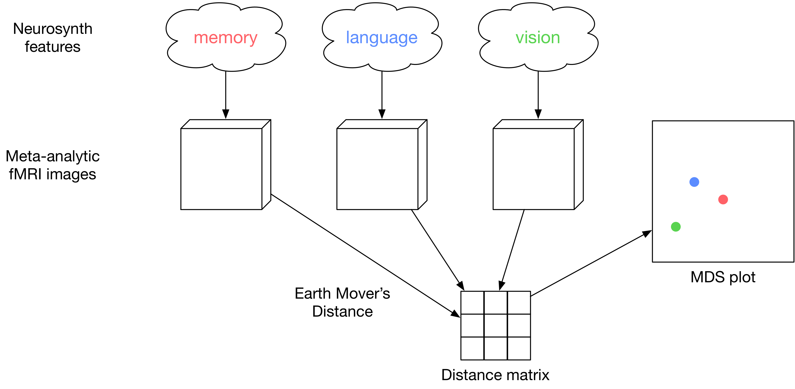

# brain_matrix

brain_matrix is a python package for distance metric oriented fMRI meta-analysis. The package provides one main class `BrainMatrix` that represents a distance matrix over fMRI images. By default, images are pulled from [Neurosynth](http://www.neurosynth.org) using keyword features like "semantic" or "anxiety". For a distance metric, we provide [Earth Movers Distance](
https://en.wikipedia.org/wiki/Earth_mover%27s_distance), a metric that has been successfully used to compare 2D images. However, one can also provide their own distance metric function.

## Usage
Using `BrainMatrix` is fairly straightforward. An example is the best explanation:

```python
from brain_matrix import BrainMatrix
# Note: the neurosynth database will be downloaded on the first run, which
# takes 5 minutes with a 13 Mbps connection.
# We use an excessively large downsample value to make the demo run quickly.
matrix = BrainMatrix(metric='emd', downsample=30, name='example')
matrix.compute_distances(['syntactic', 'speech', 'semantic', 'music'])
print(matrix['semantic']['speech'].distance)
# distance matrix in csv form
matrix.write_csv()
# create some figure in figs/
matrix.plot_dendrogram()
matrix.plot_mds(clusters=2, dim=3, interactive=True)
```

A more detailed example can be found in [this notebook](example.ipynb).

## How does this work and why should I care?



This package allows the user to explore the similarity structure of a set of fMRI images. Given a set of images, BrainMatrix computes the distance between each image with a user-specified distance metric. By applying Multidimensional scaling to the resulting distance matrix, we can construct a low dimensional *image-distance space*. Embedding the images into this space allows one to visualize and intuitively understand the similarity structure of those images.

Importantly, image-distance space incorporates only the relative differences between images, not any information about the images themselves. Thus, the similarity structure of three images will vary depending upon what other images are included in the analysis. Although this behavior may seem undesirable, it is actually the main advantage of our approach. By looking only at the relative similarities between images, we abstract away from the complex relationship between brain structure and meaningful cognitive science concepts. To the extent that the fMRI images capture the cognitive concepts we are interested in, the dimensions of the associated image-distance space will capture those concepts as well. Specifically, Multidimensional scaling will find the dimensions that best capture the relative differences between the fMRI images associated with the cognitive concepts.


### Mapping cognitive concepts to fMRI images
The most straightforward way to generate an fMRI image for a concept we are interested in is to run an fMRI study in which participants engage in a task that is though to relate to the given concept (e.g. listening to an audiobook if the concept of interest is language comprehension). However, this is a very expensive and time-intensive process that not all researchers have the resources to undertake.

To make BrainMatrix accessible to researchers without their own fMRI data, the package provides an interface to the meta-analysis platform [Neurosynth](http://www.neurosynth.org). This platform uses natural language processing and statistical inference to map cognitive science terms to fMRI images. Concretely, Neurosynth creates a meta-analytic fMRI image for a given keyword (e.g. "visual") by combining all reported activations from papers in which the word ("visual") occurs frequently ([read more](http://neurosynth.org/faq/#q2)).


### Measuring the distance between fMRI images
The key insight of BrainMatrix is to embed fMRI images into an *image-distance space* with cognitively meaningful dimensions. This requires specifying a distance metric.

An fMRI image is a three dimensional array, where each element corresponds to a voxel (a small cube in the brain). The value of an element reflects the activity level of the neurons in that location in the brain. Perhaps the most straightforward distance metric is the Euclidean distance. However this treats all voxels as independent dimensions, ignoring the distance between the voxels themselves.

We would like a metric that takes into account the spatial layout of each voxel; one such metric is the Earth Movers Distance (EMD).
To intuitively understand EMD, imagine a two dimensional image is constructed physically as a grid with one location for each pixel, where we stack dirt in each grid location based on the intensity of the corresponding pixel.
EMD is the amount of work it takes to transform one image into another by moving dirt within this grid, where work is defined as the amount of dirt moved multiplied by the distance it is moved.
Thus, a pair of images with high pixel intensities in disparate locations will be judged as more different than a pair with high intensities in different, but nearby pixels.

Complicating matters slightly, we see that EMD requires a distance metric of it's own.
Because the pixels in fMRI images are voxels, we call this metric the _voxel metric_.
Constructing an appropriate voxel metric is a significant challenge by itself. Ideally it would capture the details of brain structure (gyri and sulci and whatnot), perhaps even the functional connectivity among regions. Lacking the expertise necessary to construct such a metric, we use Euclidean distance in our examples. However, the package makes it straightforward for a researcher to use an anatomically informed metric.

Our package uses the C++ implementation of Earth Movers Distance by [Ofir Pele and Michael Werman ](http://www.ariel.ac.il/sites/ofirpele/fastemd/), with a python wrapper developed by [Will Mayner](https://github.com/wmayner/pyemd). 


<!-- http://ieeexplore.ieee.org/document/1453520/ -->


<!-- _The degree to which EMD accurately reflects the functional differences of brain images is highly dependent on the degree to which our voxel metric reflects the functional differences of voxels._ -->

<!-- The present implementation uses a simple and far from ideal voxel metric of Euclidean distance. That is, we assume that voxels are functionally similar to the degree to which they are spatially close. Superficially, this assumption is faulty because it ignores the physical structure of the brain, the gyri and sulci and whatnot. More seriously, however, this assumption ignores the connectivity structure of the brain. That is, two brain areas could be physically disparate, but functionally close if there is a fast path of communication between the two. _Creating a voxel metric based on connectivity rather than spatial distance would constitute a major improvement to this model._ Perhaps surprisingly, however, we find that this unsophisticated metric still gives highly intuitive results. This is likely because, in general, the brain attempts to minimize long range connections [citation neeeded].
 -->

## Example results
To demonstrate BrainMatrix in action, we constructed a matrix using `TODO` features from Neurosynth. Visualizations of this matrix are shown below.

### Multidimensional scaling


### Dendrogram


<!-- 
## Process
A rough description of the processing pipeline:

- for each feature
    - get a list of studies that Neurosynth has labeled with this feature
    - get a composite fMRI image (using Neurosynth) for these studies
    - transform this image into a lower dimensional form using the `image_transform` function. This is a block reduction by default, but the user could provide an alternative (perhaps anatomically justified) transformation function.
- for each pair of features
    - get the image associated with each feature
    - compute the distance between the two features as defined by `metric`. By default, we use Earth Movers Distance. The user can provide her own function that two images in the form returned by `image_transform` (a three dimensional array by  default). -->
